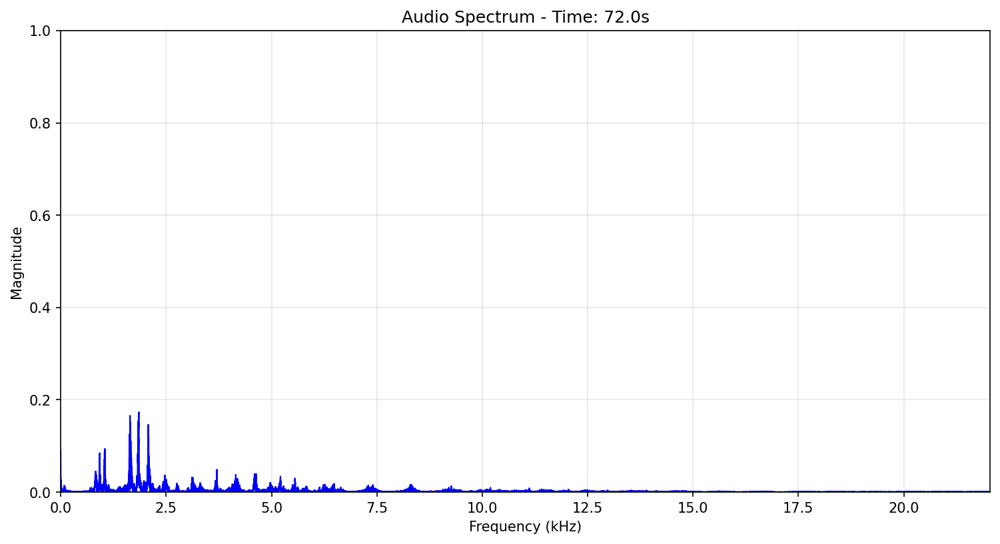

# FFT-Audio-Visualization

## Overview
This is an educational repository on the implementation of Fast Fourier Transformation (FFT) on decomposing audio signals into freuqnecy components. The `render.py` file enables the rendering of mp3 files into a collection of frames, featuring normalied magnitude vs frequency, to be rendered into mp4 file that matches the audio duration. A rendered video can be found here in (google drive)[https://drive.google.com/file/d/10p5afqeO3YnPXN-zxB3qC1EI-3o1pjj0/view?usp=sharing] that displays fft-results at 60 fps. 

## Results
<p align="center">
  
</p>

## Table of Contents
- [Results](#results)
- [Installation](#installation)
- [Usage](#usage)
  - [Inference](#inference)
  - [Training](#training)

## Installation
1. Clone the repository:
    ```bash
    git clone https://github.com/CodeKnight314/FFT-Audio-Visualization
    ```

2. Create and activate a virtual environment (optional but recommended):
    ```bash
    python -m venv fft-env
    source fft-env/bin/activate
    ```

3. cd to project directory: 
    ```bash 
    cd FFT-Audio-Visualization/
    ```

4. Install the required packages:
    ```bash
    pip install -r requirements.txt
    ```

## Usage
Use the `render.py` script to perform FFT-Decomposition on given audio files in a specified directory.

**Arguments:**
- `audio_file`: Path reference of audio file
- `output_directory`: Directory to save frames and mp4
- `fps`: Desired frames per second. Larger fps results in longer render time.

**Example:**
```bash
python render.py ./path/to/audio ./path/to/output 60
```